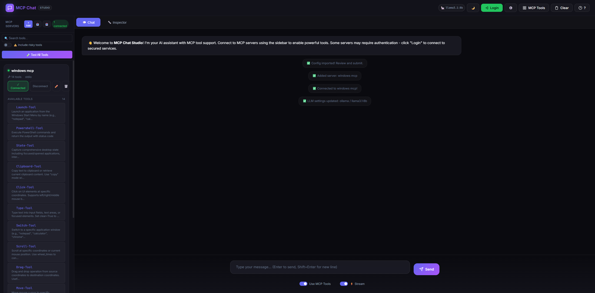
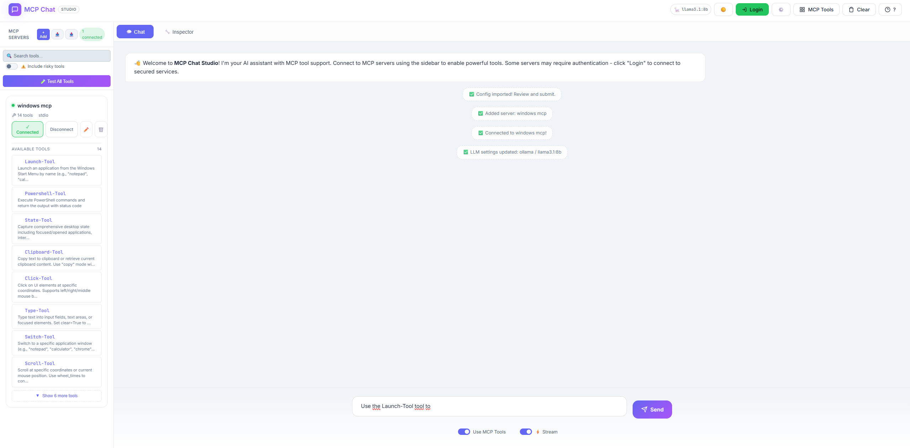
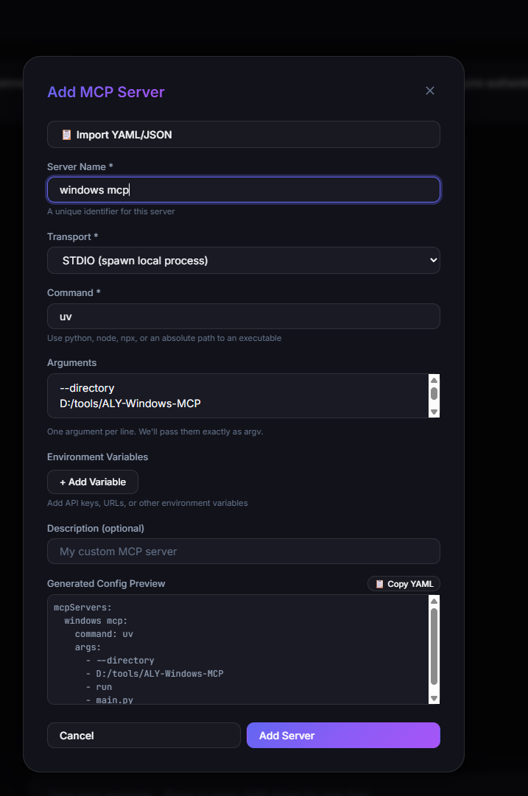
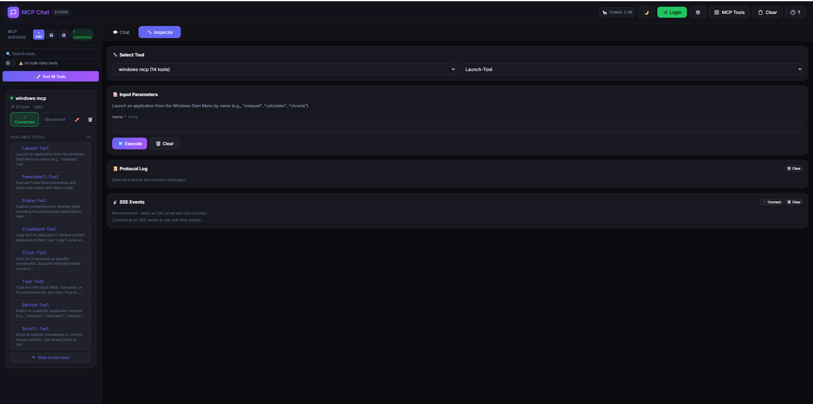
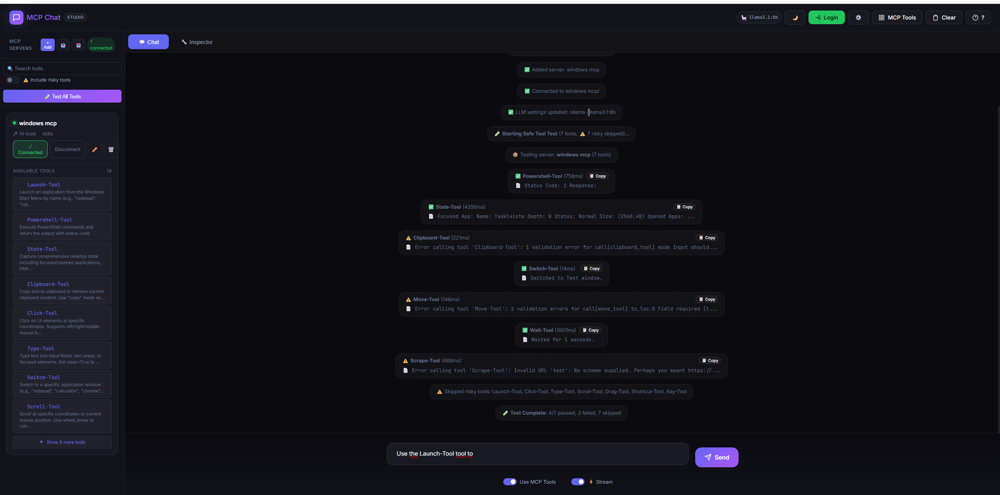
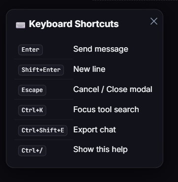

# MCP Chat Studio

**A powerful MCP (Model Context Protocol) testing and development tool with a modern glassmorphism UI.**


---

## ✨ Why MCP Chat Studio?

- **🎯 Built for MCP Development** - Test and debug MCP servers without writing code
- **🔧 7 LLM Providers** - Switch between Ollama, OpenAI, Claude, Gemini, Azure, Groq, and Together AI
- **🧪 One-Click Testing** - Smoke test all MCP tools with a single click
- **🔍 Low-Level Debugging** - Inspector tab for raw MCP protocol inspection
- **🐳 Production Ready** - Docker support, CI/CD, security-hardened
- **💡 Zero Config Start** - Works with Ollama out of the box, no API keys needed
- **🎨 Beautiful UI** - Modern glassmorphism design with dark/light themes

**Perfect for:**

- MCP server developers testing their tools
- Comparing different LLM providers with the same tools
- Debugging MCP protocol issues
- Building MCP-powered applications

---

## 📸 Screenshots

<details>
<summary>Click to view screenshots</summary>

### Main Chat Interface



### Light Mode



### Adding MCP Servers



### Tool Inspector (Low-Level Debugging)



### Tool Testing



### Keyboard Shortcuts



</details>

---

## 🚀 Features

### 💬 Multi-Provider LLM Chat

- **Ollama** - Local LLM (llama3, mistral, qwen, etc.)
- **OpenAI** - GPT-4o, GPT-4, GPT-3.5
- **Anthropic** - Claude 3.5, Claude 3
- **Google Gemini** - Gemini Pro, Gemini Flash
- **Azure OpenAI** - Enterprise Azure deployments
- **Groq** - Ultra-fast inference (Mixtral, LLaMA)
- **Together AI** - Open-source models
- **Real-time streaming** with typing effect

### 🔧 MCP Tool Management

- **Dynamic server management** - Add/remove servers at runtime
- **STDIO & SSE transports** supported
- **Environment variables** - Configure API keys, URLs per server
- **Import YAML/JSON** - Paste config from docs
- **Config preview** - See generated config before adding

### 🧪 Tool Testing

- **Test All Tools** - Smoke test all connected tools
- **Response preview** - See what each tool returns
- **Timing** - Measure tool response times
- **Safe mode** - Skip risky tools (Click, Type, Launch)
- **Error detection** - Uses MCP's `isError` field

### 🔧 Inspector Tab (Low-Level Debugging)

- **Manual tool execution** - Call any tool with custom arguments
- **Auto-generated forms** - Input fields from JSON schema
- **Protocol log** - See raw MCP request/response JSON
- **SSE event viewer** - Real-time server events for SSE transports
- **Resources/Prompts API** - Full MCP protocol support

### 📤 Config Export/Import

- **Export** - Download your config as YAML
- **Import** - Load config from YAML/JSON file
- **Team sharing** - Share configs across machines

### 🔒 Flexible Authentication

- **Keycloak** - Full OIDC with PKCE
- **GitHub** - OAuth2 preset
- **Google** - OAuth2 preset
- **Custom** - Any OAuth2 provider with custom URLs

### 🎨 Modern UI

- **Glassmorphism design** - Frosted glass aesthetic
- **Dark/Light theme** - Toggle with 🌙/☀️
- **Tool schema viewer** - See parameter details inline
- **Responsive layout** - Works on all screen sizes

### ⌨️ Keyboard Shortcuts

| Shortcut       | Action               |
| -------------- | -------------------- |
| `Enter`        | Send message         |
| `Shift+Enter`  | New line             |
| `Escape`       | Cancel / Close modal |
| `Ctrl+K`       | Focus tool search    |
| `Ctrl+Shift+E` | Export chat          |
| `Ctrl+/`       | Show shortcuts help  |

---

## 📦 Installation

### Prerequisites

- **Node.js** 18+
- **npm** or **yarn**

### Quick Start

```bash
# Clone the repository
git clone https://github.com/JoeCastrom/mcp-chat-studio.git
cd mcp-chat-studio

# Install dependencies
npm install

# Copy environment template
cp .env.example .env

# Start the server
npm run dev
```

Open **http://localhost:3082** in your browser.

---

## 🐳 Docker Deployment

### Using Docker Compose (Recommended)

#### Option 1: Use Your Local Ollama (Default)

If you already have Ollama installed on your machine:

```bash
# Start MCP Chat Studio only (uses your local Ollama)
docker-compose up

# Run in background
docker-compose up -d
```

The app automatically connects to your local Ollama at `http://localhost:11434`.

#### Option 2: Include Ollama in Docker

If you don't have Ollama installed locally:

```bash
# Start both MCP Chat Studio AND Ollama in Docker
docker-compose --profile with-ollama up

# Run in background
docker-compose --profile with-ollama up -d
```

**Services started:**

- MCP Chat Studio: http://localhost:3082
- Ollama (if using profile): http://localhost:11434

#### Configure API Keys

```bash
# Create .env file or set environment variables
OPENAI_API_KEY=sk-your-key
ANTHROPIC_API_KEY=sk-ant-your-key
GOOGLE_API_KEY=your-google-key
```

### Using Docker Only

```bash
# Build image
docker build -t mcp-chat-studio .

# Run with Ollama (default)
docker run -p 3082:3082 mcp-chat-studio

# Run with OpenAI
docker run -p 3082:3082 \
  -e OPENAI_API_KEY=sk-your-key \
  mcp-chat-studio

# Run with custom config
docker run -p 3082:3082 \
  -v $(pwd)/config.yaml:/app/config.yaml:ro \
  mcp-chat-studio
```

### Health Check

```bash
curl http://localhost:3082/api/health
```

**Response:**

```json
{
  "status": "ok",
  "mcpServers": {
    "server-name": "connected"
  }
}
```

---

## ⚙️ Configuration

### LLM Providers

MCP Chat Studio supports **8 LLM providers**. Configure in `config.yaml`:

#### Ollama (Local - Default)

```yaml
llm:
  provider: ollama
  model: llama3.2
```

No API key needed. Just run `ollama serve`.

#### OpenAI

```yaml
llm:
  provider: openai
  model: gpt-4o
```

```bash
# .env
OPENAI_API_KEY=sk-your-key
```

#### Anthropic Claude

```yaml
llm:
  provider: anthropic
  model: claude-3-5-sonnet-20241022
```

```bash
# .env
ANTHROPIC_API_KEY=sk-ant-your-key
```

#### Google Gemini

```yaml
llm:
  provider: gemini
  model: gemini-1.5-flash
```

```bash
# .env
GOOGLE_API_KEY=your-google-ai-key
```

#### Azure OpenAI

```yaml
llm:
  provider: azure
  model: gpt-4o
```

```bash
# .env
AZURE_OPENAI_API_KEY=your-key
AZURE_OPENAI_ENDPOINT=https://your-resource.openai.azure.com
AZURE_OPENAI_DEPLOYMENT=your-deployment-name
```

#### Groq (Ultra-fast)

```yaml
llm:
  provider: groq
  model: llama-3.3-70b-versatile
```

```bash
# .env
GROQ_API_KEY=gsk_your-key
```

#### Together AI

```yaml
llm:
  provider: together
  model: meta-llama/Llama-3.3-70B-Instruct-Turbo
```

```bash
# .env
TOGETHER_API_KEY=your-key
```

### MCP Servers (`config.yaml`)

```yaml
mcpServers:
  my-mcp-server:
    type: stdio
    command: python
    args:
      - -m
      - my_mcp_server
    env:
      API_KEY: '${API_KEY}' # From .env
    description: 'My custom MCP server'
    startup: true # Auto-connect on startup
```

---

## 🛠️ Adding MCP Servers

### Via UI (Recommended)

1. Click **+ Add** in the sidebar
2. Fill in server details:
   - **Name**: Unique identifier
   - **Transport**: STDIO or SSE
   - **Command/URL**: How to start/connect
   - **Arguments**: Command-line args
   - **Environment Variables**: API keys, URLs
3. Preview the generated config
4. Click **Add Server**

### Via Import

1. Click **📋 Import YAML/JSON**
2. Paste your config:

```yaml
command: python
args:
  - -m
  - my_server
env:
  API_KEY: sk-xxx
```

3. Click **Import** → Form auto-fills
4. Review and **Add Server**

---

## 🎯 Example MCP Servers

Get started quickly with these popular MCP servers:

### GitHub MCP Server

Access GitHub repositories, issues, PRs, and more:

```yaml
mcpServers:
  github:
    type: stdio
    command: npx
    args:
      - '@modelcontextprotocol/server-github'
    env:
      GITHUB_TOKEN: '${GITHUB_TOKEN}'
    description: 'GitHub API integration'
    startup: true
```

**In .env:**

```bash
GITHUB_TOKEN=ghp_your_github_personal_access_token
```

**Installation:**

```bash
npm install -g @modelcontextprotocol/server-github
```

### Filesystem MCP Server

Secure file operations with access control:

```yaml
mcpServers:
  filesystem:
    type: stdio
    command: npx
    args:
      - '@modelcontextprotocol/server-filesystem'
      - '/path/to/allowed/directory'
    description: 'File system operations'
```

**Note:** Only has access to the specified directory for security.

### Brave Search MCP Server

Web search capabilities:

```yaml
mcpServers:
  brave-search:
    type: stdio
    command: npx
    args:
      - '@modelcontextprotocol/server-brave-search'
    env:
      BRAVE_API_KEY: '${BRAVE_API_KEY}'
    description: 'Web search via Brave'
```

### Puppeteer MCP Server

Browser automation and web scraping:

```yaml
mcpServers:
  puppeteer:
    type: stdio
    command: npx
    args:
      - '@modelcontextprotocol/server-puppeteer'
    description: 'Browser automation'
```

### More Official Servers

- **@modelcontextprotocol/server-postgres** - PostgreSQL database access
- **@modelcontextprotocol/server-sqlite** - SQLite database operations
- **@modelcontextprotocol/server-slack** - Slack integration
- **@modelcontextprotocol/server-google-maps** - Google Maps API

**Find more:** [MCP Servers Directory](https://github.com/modelcontextprotocol/servers)

---

## 🧪 Testing Tools

### Test All Tools

1. Connect to an MCP server
2. Click **🧪 Test All Tools**
3. View results:
   - ✅ Tool works with minimal input
   - ⚠️ Tool responded but input validation failed
   - ❌ Tool failed completely

### Risky Tools

Some tools have side effects and are **skipped by default**:

- `Click-Tool` - Clicks on screen
- `Type-Tool` - Types text
- `Launch-Tool` - Opens applications
- `Drag-Tool`, `Key-Tool`, `Shortcut-Tool`, `Scroll-Tool`

Check **⚠️ Include risky tools** to test them.

### Response Data

- Each test shows a **preview** of the response
- Click **📋 Copy** to copy full JSON
- **Duration** shows response time in ms

---

## 💬 Using the Chat

### Basic Chat

1. Type a message and press Enter
2. The LLM responds (with streaming if enabled)

### Using MCP Tools

1. Enable **Use MCP Tools** checkbox
2. The LLM can call any connected tool
3. Tool results appear in the chat

### Streaming

- Enable **⚡ Stream** for real-time typing effect
- Streaming is disabled when tools are enabled (tools need full response)

### Force Tool Mode

1. Click a tool in the sidebar
2. Click **Force** to require the LLM to use it
3. Badge shows which tool is forced

---

## 🔧 Inspector Tab

The Inspector provides **low-level MCP debugging** without using the LLM.

### How to Use

1. Click the **🔧 Inspector** tab
2. Select a **Server** from the dropdown
3. Select a **Tool** from the dropdown
4. Fill in the **parameters** (auto-generated from schema)
5. Click **▶️ Execute**
6. View the **raw JSON response**

### Input Types

| Schema Type | Input Field           |
| ----------- | --------------------- |
| string      | Text input            |
| number      | Number input          |
| boolean     | True/False dropdown   |
| array       | JSON textarea         |
| object      | JSON textarea         |
| enum        | Dropdown with options |

### When to Use

- **Debugging** - Test tools without LLM interpretation
- **Development** - Iterate on tool parameters quickly
- **Verification** - Check exact MCP responses

---

## 📁 Project Structure

```
mcp-chat-studio/
├── public/
│   └── index.html        # Single-page UI (HTML + CSS + JS)
├── server/
│   ├── index.js          # Express server entry
│   ├── routes/
│   │   ├── chat.js       # Chat & LLM endpoints
│   │   ├── llm.js        # LLM settings endpoints
│   │   ├── mcp.js        # MCP management endpoints
│   │   └── oauth.js      # OAuth endpoints
│   └── services/
│       ├── LLMClient.js  # Multi-provider LLM client
│       └── MCPManager.js # MCP server manager
├── config.yaml           # MCP server configs
├── .env                  # Environment variables
└── package.json
```

---

## 🔌 API Endpoints

### Chat

| Method | Endpoint             | Description                        |
| ------ | -------------------- | ---------------------------------- |
| POST   | `/api/chat`          | Send message (streaming supported) |
| POST   | `/api/chat/continue` | Continue after tool call           |

### MCP

| Method | Endpoint                   | Description             |
| ------ | -------------------------- | ----------------------- |
| GET    | `/api/mcp/status`          | Get server statuses     |
| GET    | `/api/mcp/tools`           | Get all available tools |
| POST   | `/api/mcp/add`             | Add new server          |
| POST   | `/api/mcp/connect`         | Connect to server       |
| POST   | `/api/mcp/disconnect`      | Disconnect from server  |
| POST   | `/api/mcp/call`            | Call a tool             |
| DELETE | `/api/mcp/remove/:name`    | Remove server           |
| GET    | `/api/mcp/resources/:name` | List resources          |
| POST   | `/api/mcp/resources/read`  | Read a resource         |
| GET    | `/api/mcp/prompts/:name`   | List prompts            |
| POST   | `/api/mcp/prompts/get`     | Get a prompt            |

### LLM

| Method | Endpoint            | Description              |
| ------ | ------------------- | ------------------------ |
| GET    | `/api/llm/settings` | Get current LLM settings |
| POST   | `/api/llm/settings` | Update LLM settings      |

---

## 🎨 Theming

Toggle between **Dark** and **Light** mode using the 🌙/☀️ button in the header.

Theme is saved to localStorage and persists across sessions.

---

## 🔒 Authentication (Optional)

MCP Chat Studio supports multiple OAuth2 providers:

### Provider Presets

```yaml
oauth:
  provider: keycloak # or github, google
  client_id: '${OAUTH_CLIENT_ID}'
  client_secret: '${OAUTH_CLIENT_SECRET}'
  redirect_uri: 'http://localhost:3082/api/oauth/callback'

  # Keycloak-specific
  keycloak_url: 'https://your-keycloak/auth'
  keycloak_realm: 'your-realm'
```

### Custom OAuth2 Provider

```yaml
oauth:
  authorize_url: 'https://provider.com/oauth/authorize'
  token_url: 'https://provider.com/oauth/token'
  userinfo_url: 'https://provider.com/api/userinfo'
  client_id: '${OAUTH_CLIENT_ID}'
  client_secret: '${OAUTH_CLIENT_SECRET}'
  scopes: ['openid', 'profile', 'email']
  use_pkce: true # false for legacy providers
```

### Environment Variables

```bash
OAUTH_CLIENT_ID=your-client-id
OAUTH_CLIENT_SECRET=your-secret
OAUTH_AUTHORIZE_URL=https://...  # For custom providers
OAUTH_TOKEN_URL=https://...
```

Click **Login** to authenticate.

---

## 🔐 Security Best Practices

### Important Security Notes

- ⚠️ **Never commit `.env` file** - Contains API keys and secrets
- ⚠️ **Use environment variables** - All secrets should be in `.env` or environment
- ⚠️ **SSL verification enabled** - Disabled only for dev with self-signed certs
- ⚠️ **OAuth tokens in memory** - Production: use Redis for persistence

### For Development

```bash
# .env (local development)
OPENAI_API_KEY=sk-your-key
ANTHROPIC_API_KEY=sk-ant-your-key

# Disable SSL verify only for internal/self-signed certs
OAUTH_DISABLE_SSL_VERIFY=true
```

### For Production

```bash
# Use secure environment variables
export OPENAI_API_KEY="sk-your-key"
export ANTHROPIC_API_KEY="sk-ant-your-key"

# Never disable SSL verification in production
# OAUTH_DISABLE_SSL_VERIFY should NOT be set

# Use Redis for OAuth tokens (multi-instance deployments)
# Modify server/services/OAuthManager.js to use Redis instead of Map
```

### MCP Server Security

- **Filesystem Server:** Only grant access to specific directories
- **Database Servers:** Use read-only credentials when possible
- **API Keys:** Store in `.env`, never in `config.yaml`
- **Network Servers (SSE):** Use HTTPS and authentication

### What's Safe to Commit

✅ **Safe:**

- `config.yaml.example`
- `.env.example`
- Source code
- Documentation

❌ **NEVER Commit:**

- `.env` (actual credentials)
- `config.yaml` (may contain secrets)
- API keys or tokens
- Certificates or private keys

---

## ❓ Frequently Asked Questions

### General

**Q: Can I use multiple MCP servers at once?**
A: Yes! Add as many as you want. Tools are automatically namespaced (e.g., `github__get_issue`, `filesystem__read_file`) to prevent conflicts.

**Q: Do I need API keys to start?**
A: No! Use Ollama locally (free, no keys required). API keys are only needed for cloud LLM providers like OpenAI, Anthropic, etc.

**Q: Can I use my own MCP server?**
A: Absolutely! Add it via the UI or edit `config.yaml`. Supports both STDIO and SSE transports.

**Q: Does this work on Windows?**
A: Yes! Works on Windows, macOS, and Linux. For Windows, use PowerShell or Git Bash for commands.

### Usage

**Q: How do I test tools without the chat?**
A: Use the **Inspector** tab to call tools directly without involving the LLM. Perfect for debugging and testing.

**Q: Why can't I use streaming with tools?**
A: LLMs need the complete response to decide which tools to call. Streaming is auto-disabled when tools are enabled.

**Q: What are "risky tools"?**
A: Tools that have side effects (clicking, typing, launching apps). They're skipped by default in "Test All Tools" to prevent unwanted actions.

**Q: How do I switch LLM providers?**
A: Click **⚙️ Settings** → Change provider and model → Save. Changes take effect immediately.

### MCP Servers

**Q: What's the difference between STDIO and SSE?**
A: **STDIO** runs locally as a subprocess. **SSE** connects to remote servers over HTTP. Use STDIO for local tools, SSE for network services.

**Q: Can MCP servers see my API keys?**
A: Only if you explicitly pass them via environment variables. Each server only sees the env vars you configure for it.

**Q: My MCP server won't connect. What's wrong?**
A: Check:

1. Command/path is correct
2. Required dependencies installed (`npm install -g ...`)
3. Environment variables set
4. Server logs in browser console (F12)

**Q: Can I use the same MCP server with different configurations?**
A: Yes! Add it multiple times with different names and configs. For example, `github-personal` and `github-work` with different tokens.

### Development

**Q: How do I add a new LLM provider?**
A: Edit `server/services/LLMClient.js`. See [CONTRIBUTING.md](CONTRIBUTING.md) for details.

**Q: Can I contribute new features?**
A: Yes! We welcome contributions. See [CONTRIBUTING.md](CONTRIBUTING.md) for guidelines.

**Q: Is there an API for automation?**
A: Yes! See the **API Endpoints** section. All features are accessible via REST API.

---

## 🐛 Troubleshooting

### MCP Server Won't Connect

1. Check the command/path is correct
2. Verify environment variables
3. Check server logs in console
4. Try running the command manually

### LLM Not Responding

1. Check provider settings in ⚙️ Settings
2. Verify Ollama is running (`ollama serve`)
3. Check API key for OpenAI

### Tools Show ⚠️ Warning

This means the tool **responded** but our dummy test input was invalid. The tool is working - it just needs proper arguments.

---

## 📜 License

MIT License - feel free to use and modify.

---

## 🤝 Contributing

We welcome contributions from the community! Whether it's bug fixes, new features, documentation improvements, or examples - all contributions are appreciated.

### How to Contribute

1. **Fork** the repository
2. **Clone** your fork: `git clone https://github.com/YOUR_USERNAME/mcp-chat-studio.git`
3. **Create a branch**: `git checkout -b feature/amazing-feature`
4. **Make changes** and test thoroughly
5. **Format code**: `npm run format`
6. **Lint code**: `npm run lint`
7. **Commit**: `git commit -m 'feat: add amazing feature'`
8. **Push**: `git push origin feature/amazing-feature`
9. **Open a Pull Request**

### Contribution Guidelines

Please read [CONTRIBUTING.md](CONTRIBUTING.md) for:

- Code style guidelines
- Commit message conventions
- Testing requirements
- Pull request process

### Found a Bug?

[Open an issue](https://github.com/JoeCastrom/mcp-chat-studio/issues/new?template=bug_report.md) with:

- Clear description
- Steps to reproduce
- Expected vs actual behavior
- Screenshots if applicable
- Environment details (OS, Node version, etc.)

### Want a Feature?

[Request it here](https://github.com/JoeCastrom/mcp-chat-studio/issues/new?template=feature_request.md) with:

- Use case description
- Proposed solution
- Alternatives considered

### Quick Contribution Ideas

- 🐛 Fix a bug from [issues](https://github.com/JoeCastrom/mcp-chat-studio/issues)
- 📚 Improve documentation
- 🧪 Add tests
- 🎨 Improve UI/UX
- 🔌 Add new LLM provider
- 📦 Create example MCP servers
- 🌐 Add translations

---

## 🙏 Acknowledgments

- **Created by** [Youssef Ghazi](https://github.com/JoeCastrom)
- Built with [Model Context Protocol](https://modelcontextprotocol.io)
- Inspired by the MCP community
- Thanks to all contributors!

---

**Built with ❤️ by Youssef Ghazi for MCP developers**
