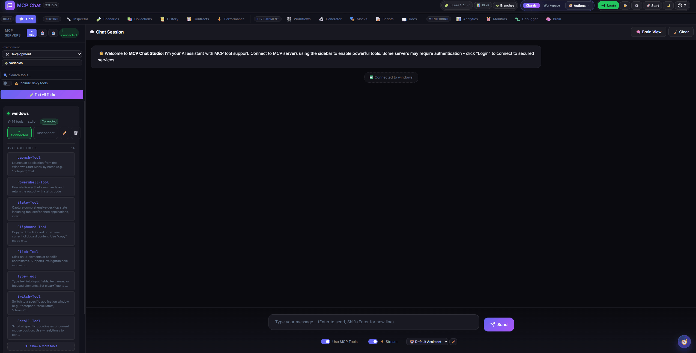
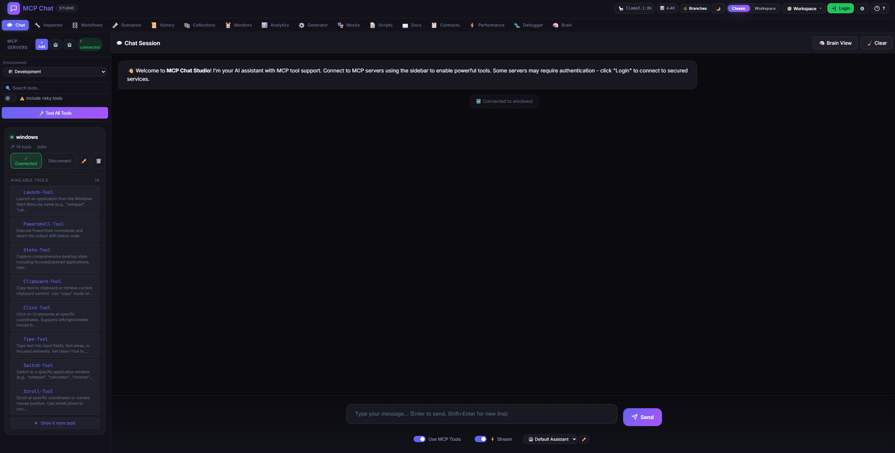

# 🚀 MCP Chat Studio

**The Ultimate Testing Platform for MCP Servers**

Test, debug, and develop Model Context Protocol servers with a beautiful glassmorphism UI and a powerful Workspace mode.  
**Record scenarios** • **Collections + run reports** • **Workspace canvas** • **Workflow export (Python + Node)** • **Mock servers** • **Docs generator** • **Zero config with Ollama**

**Need help?** Use the **Studio Assistant** (bottom‑right compass) to learn features, generate workflows, import OpenAPI, and navigate the UI — just ask it.


[](https://github.com/JoeCastrom/mcp-chat-studio/actions/workflows/ci.yml)


> **🆕 Major Update (January 2025):** This version includes significant new features like OAuth config UI, LLM settings persistence, E2E tests, session management, security enhancements, and much more. The previous stable version is available in the [`v2` branch](https://github.com/JoeCastrom/mcp-chat-studio/tree/v2) as a backup.

## 🎬 Showcase


| Workspace Canvas                                        | Studio Assistant                                       | AI Workflow Builder                                               | Documentation Generator                                          |
| ------------------------------------------------------- | ------------------------------------------------------ | ----------------------------------------------------------------- | ---------------------------------------------------------------- |
|  |  |  |  |

> **📌 Local MCP Test Bench** - Designed for development. Not intended for internet exposure.

---

## ⚡ Get Started in 60 Seconds

```bash
# 1. Clone and install
git clone https://github.com/JoeCastrom/mcp-chat-studio.git && cd mcp-chat-studio && npm install

# 2. Start (works with Ollama out of the box - no API keys needed!)
npm run dev

# 3. Open http://localhost:3082 and start testing! 🎉
```

**That's it!** You now have a complete MCP testing platform running locally.
Toggle **Classic / Workspace** in the header to pick your workflow.
Use the **model badge** in the header to switch LLM providers; the **⚙️ Settings** button handles model/auth tuning.

---

## 🆚 Why Not Just Use Claude Desktop or ChatGPT?

| Feature                          | MCP Chat Studio |  Claude Desktop  |     ChatGPT      |
| -------------------------------- | :-------------: | :--------------: | :--------------: |
| Test ALL tools automatically     |       ✅        |        ❌        |        ❌        |
| Record & Replay scenarios        |       ✅        |        ❌        |        ❌        |
| Workflow debugger (breakpoints)  |       ✅        |        ❌        |        ❌        |
| Bulk testing (multiple inputs)   |       ✅        |        ❌        |        ❌        |
| Response diffing                 |       ✅        |        ❌        |        ❌        |
| Contract testing                 |       ✅        |        ❌        |        ❌        |
| Tool usage analytics             |       ✅        |        ❌        |        ❌        |
| Custom assertions (14 operators) |       ✅        |        ❌        |        ❌        |
| Low-level MCP debugging          |       ✅        |        ❌        |        ❌        |
| Mock server generator            |       ✅        |        ❌        |        ❌        |
| 9 LLM providers + custom         |       ✅        | ❌ (Claude only) | ❌ (OpenAI only) |
| Local/no API keys needed         |   ✅ (Ollama)   |        ❌        |        ❌        |
| Multi-environment profiles       |       ✅        |        ❌        |        ❌        |
| Session branching                |       ✅        |        ❌        |        ❌        |

---

## 🧭 Two Layouts: Classic + Workspace

**Classic Mode** keeps the familiar sidebar + tabs for focused work.  
**Workspace Mode** turns every tool into a draggable panel on an infinite canvas:

- **Radial menu** to add panels (right-click)
- **Quick access bar** for fast panel focus
- **Zoom, pan, mini-map, fit-all**
- **Command palette** (Ctrl+K / Ctrl+Shift+P)
- **Workspace sessions** + **export/import** bundles

---

## 🎨 Highlights: Advanced Testing & Debugging Suite

### 🐛 Workflow Debugger

Debug complex workflows with professional debugging tools:

- **Breakpoint debugging** - Pause execution at any node
- **Step-through mode** - Execute one node at a time
- **Variable inspection** - View inputs, outputs, and context
- **Session management** - Pause, resume, step, or abort

### ✨ AI Workflow Builder

Generate workflows from a natural-language goal:

- **Tool-aware prompts** - Uses connected MCP tools as context
- **One-click generate** - Creates a workflow you can edit and run
- **Works with Workspace and Classic modes**
- **Preflight validation** - Catch missing tool args and invalid JSON before execution

### 📦 Workflow Export

Turn visual flows into runnable scripts:

- **Python (mcp SDK)** and **Node.js (mcp SDK)**
- **Tool calls + variable substitution** baked in
- **Shareable** automation for CI or docs

### 🔍 Advanced Inspector

Three powerful new testing tools:

- **📊 Timeline** - Chronological log of all JSON-RPC messages
- **🧪 Bulk Test** - Execute tools with multiple inputs (parallel/sequential)
- **🔥 Bulk Test Heatmap** - Visualize latency spread across inputs + export JSON with heatmap data
- **🎬 Fuzz Fail → Scenario** - Save failing cases as replayable scenarios
- **📚 Failure Datasets** - Store bulk-test failures as dataset rows for data runs
- **🔀 Diff** - Side-by-side comparison with similarity scoring
- **🌐 Cross-Server Snapshot** - Run one tool across servers and diff output
- **🧭 Matrix wizard** - Pick servers + common-tool filter before running diffs
- **🌐 One-click Matrix** - Run a tool across servers from the Inspector response
- **🕘 History → Matrix** - Launch a cross-server compare directly from past runs
- **🧪 Schema Fuzzing** - Generate edge-case inputs from tool schemas
- **🔍 Resolved Preview** - See variable substitutions before execution
- **🔐 Per-request Auth Overrides** - Bearer/Basic/API key + header/query overrides for OpenAPI proxy tools
- **🔐 OAuth Settings UI** - Configure OAuth providers without touching config.yaml or .env (includes a Test OAuth button)

### 📋 Contract Testing

Consumer-driven contract testing for MCP servers:

- **Define contracts** - Specify expected tool behavior
- **Multiple assertions** - Schema, contains, equals, response time, custom
- **Auto-generation** - Generate contracts from tool schemas
- **Version tracking** - Track contract changes over time
- **Schema Watch** - Live drift detection with optional background checks
- **Schema CI Gate** - One-click baseline export + CI fail-on-change command

### 📊 Tool Explorer & Analytics

Real-time usage statistics and performance metrics:

- **Usage tracking** - Calls, success rates, latency per tool
- **Performance metrics** - p50/p95/p99 latency tracking
- **Error monitoring** - Recent errors per tool
- **Server health badges** - Connected/Failed/Not connected with details + retry
- **Leaderboards** - Most-used tools across servers
- **Health dashboard** - System-wide health overview
- **Flake radar** - Highlights tools with rising failure or latency jitter
- **Flake alerts** - Baseline + regression checks for tool reliability

### 📚 Documentation Generator

Publish MCP server docs in seconds:

- **Markdown / HTML / JSON**
- **Tools + schemas + examples**
- **Shareable docs bundle**

### ⏱️ Monitors & Performance

Keep an eye on quality and latency:

- **Scheduled monitors** with pass/fail history
- **Performance tab** with p50/p95/p99 and trends
- **Health check dashboards**

### 🧭 Workspace Mode

Build your own testing cockpit with floating panels:

- **Add panels fast** - Radial menu + quick-access bar
- **Canvas controls** - Zoom, pan, mini-map, fit-all
- **Command palette** - Ctrl+K / Ctrl+Shift+P
- **Sessions + bundles** - Save/restore layouts, export/import JSON
- **Templates** - Save and reuse workspace presets

---

## 🎨 Visual MCP Server Generator

Create production-ready MCP servers without writing boilerplate code!

- 🎨 **Visual tool designer** with parameters and types
- 🧾 **OpenAPI import** (JSON + YAML) to auto-create tools from API specs (paths + webhooks)
- 🛰️ **OpenAPI Proxy mode** - generate runnable MCP servers that call real APIs
- 📦 **Project bundle export** - download a ready-to-run MCP server folder from the Generator
- 🗜️ **ZIP export** - one-click runnable project archive
- 🧪 **Test in Studio** - copy config + open Add Server to wire the generated MCP quickly
- ✅ **Guided Test flow** - step-by-step run commands + required working directory
- 🚀 **Run & Connect (Auto)** - Studio writes a temporary project folder and connects it for you (Python auto-run requires `mcp` installed)
  - Prompts to import selected OpenAPI endpoints if no tools are in the designer yet
  - Auto-suffixes the server name to avoid clobbering existing configs (e.g. `my-mcp-server-auto-7f3a`)
- 📂 **Save to Folder** - write the project files directly to a local folder (supported browsers)
- 🔐 **Auth mapping** - OpenAPI security schemes flow into MCP tool metadata
- 🌐 **HTTP hints** - Imported endpoints carry read-only/destructive hints via tool annotations
- 🧭 **Server URLs + tags** - Choose base URL from spec servers[] and bulk-select endpoints by tag
- ⭐ **Sample OpenAPI loader** - one-click Petstore to explore the workflow
- 🐍 **Python (mcp SDK)** and 📦 **Node.js (TypeScript)** code generation
- ⚡ Copy to clipboard or download instantly
- 🔧 Perfect for prototyping and teaching MCP

---

## 🎯 Perfect For

- **🔧 MCP Server Developers** - Test your tools without manual clicking
- **🤖 AI App Builders** - Compare GPT-4 vs Claude vs Llama on the same tasks
- **🏢 Enterprise Teams** - Share test scenarios and environments
- **🐛 Debugging** - See raw MCP protocol messages when things break
- **📚 Learning MCP** - Visual tool designer teaches protocol structure

---

## ✨ Why MCP Chat Studio?

- **🎯 Built for MCP Development** - Test and debug MCP servers without writing code
- **🔧 9 LLM Providers + Custom** - Ollama, OpenAI, Claude, Gemini, Azure, Groq, Together AI, OpenRouter + Custom
- **🧠 Ollama model picker** - UI dropdown of locally installed models (auto-detected)
- **🔄 Provider Switcher** - Swap LLMs from the model badge and manage visible providers in one place
- **🧭 Studio Assistant** - Floating help chat aware of your current panel/layout, with dock + pop‑out modes, quick actions, FAQ fallback, and drag‑and‑drop OpenAPI import
  - Commands list + recent command chips + safe confirmations + workspace builder (add/close/resize/arrange panels, sessions, export/import)
  - Paste OpenAPI URLs/JSON or upload specs to auto-import into the Generator
  - Auto action button to **Generate + Test** immediately after import
  - Resizable panel with dock, pop‑out, and size toggle
- **💬 Smart chat import** - Pasting an OpenAPI URL/JSON in the main chat offers to import into Generator
- **🧪 Test Scenarios** - Record, replay, and validate tool executions
- **🎬 History → Scenario** - Turn real tool calls into replayable test flows
- **🔁 Re-run + Diff** - Execute any past tool call and compare outputs instantly
- **🌐 Matrix Runs** - Execute the same scenario across multiple servers with baseline diffs
- **📊 Data Runs** - Replay scenarios against a JSON dataset
- **📚 Dataset Library** - Save reusable data tables for scenarios
- **🔐 OAuth in UI** - Configure auth providers and session-based servers from the app
- **🎬 Fuzz Fail → Scenario** - Convert bulk test failures into replayable scenarios
- **🌐 Cross-Server Snapshots** - Compare live tool outputs across servers
- **⚡ Flake Radar** - Spot flaky tools using live failure + jitter signals
- **🚨 Flake Alerts** - Detect regressions against a saved reliability baseline
- **📚 Collections & Run Reports** - Batch scenarios, run iterations, export JSON/JUnit + CI gate
- **⭐ Golden Baselines** - Mark trusted runs and diff against them
- **📸 Run Snapshots** - Deterministic replay + drift checks on collections (export/import)
- **🚦 Drift Gate** - Export pass/fail gate summary for CI
- **🧭 Workspace Mode** - Floating panels, zoom, mini-map, and command palette
- **📊 Response Diffing** - Semantic JSON comparison with color-coded changes
- **📋 Schema Validation** - Contract testing with auto-inferred schemas
- **🔔 Schema Watch** - Detect live schema drift across connected servers
- **📦 Workflow Export** - Generate Python or Node.js scripts from workflows
- **📚 Docs Generator** - Publish MCP documentation in one click
- **📦 Project Bundles** - Export/import full test setups (collections, mocks, envs)
- **🔍 Custom Assertions** - 14 operators with JSONPath support
- **🔍 Low-Level Debugging** - Inspector tab for raw MCP protocol inspection
- **🐳 Production Ready** - Docker support, CI/CD, security-hardened
- **💡 Zero Config Start** - Works with Ollama out of the box, no API keys needed
- **🎨 Beautiful UI** - Modern glassmorphism design with dark/light themes

---

## 📸 Screenshots

<details>
<summary>Click to view more screenshots</summary>

### Light Mode


### Adding MCP Servers


### Tool Inspector (Low-Level Debugging)


### Tool Testing


### Keyboard Shortcuts


</details>

---

## 🚀 Features

### 💬 Multi-Provider LLM Chat

- **Ollama** - Local LLM (llama3, mistral, qwen, etc.)
- **OpenAI** - GPT-4o, GPT-4, GPT-3.5
- **Anthropic** - Claude 3.5, Claude 3
- **Google Gemini** - Gemini Pro, Gemini Flash
- **Azure OpenAI** - Enterprise Azure deployments
- **Groq** - Ultra-fast inference (Mixtral, LLaMA)
- **Together AI** - Open-source models
- **Custom LLM** - OpenAI-compatible endpoints with optional OAuth token fetch
- **Real-time streaming** with typing effect

### 🔧 MCP Tool Management

- **Dynamic server management** - Add/remove servers at runtime
- **STDIO & SSE transports** supported
- **Environment variables** - Configure API keys, URLs per server
- **Import YAML/JSON** - Paste config from docs
- **Config preview** - See generated config before adding

### 🧪 Tool Testing

- **Test All Tools** - Smoke test all connected tools
- **Response preview** - See what each tool returns
- **Timing** - Measure tool response times
- **Safe mode** - Skip risky tools (Click, Type, Launch)
- **Error detection** - Uses MCP's `isError` field

### 🔧 Inspector Tab (Low-Level Debugging)

- **Manual tool execution** - Call any tool with custom arguments
- **Auto-generated forms** - Input fields from JSON schema
- **Protocol log** - See raw MCP request/response JSON
- **SSE event viewer** - Real-time server events for SSE transports
- **Resources/Prompts API** - Full MCP protocol support
- **Timeline** - Chronological JSON-RPC message log with filtering
- **Bulk Testing** - Execute tools with arrays of inputs
- **Diff Tool** - Side-by-side result comparison with similarity %

### 🐛 Workflow Debugger

- **Breakpoint debugging** - Set breakpoints on any workflow node
- **Step-through execution** - Execute workflows one node at a time
- **Variable inspection** - View all context, inputs, and outputs
- **Pause/Resume/Abort** - Full execution control
- **Debug sessions** - Multiple concurrent debug sessions
- **Execution log** - Complete history of node executions
- **11 API endpoints** - Full REST API for debugging

### 📋 Contract Testing Suite

- **Define contracts** - JSON-based contract definitions
- **Schema assertions** - Validate response structure
- **Response time limits** - Performance SLAs
- **Custom assertions** - Path-based queries with operators
- **Auto-generation** - Create contracts from tool schemas
- **Schema Watch** - Live drift detection with on-demand or auto checks
- **Version tracking** - Contract versioning and updates
- **CRUD API** - Full contract lifecycle management
- **Test reporting** - Detailed pass/fail with error messages

### 📊 Tool Explorer & Analytics

- **Usage statistics** - Total calls, success/failure rates
- **Performance metrics** - p50/p95/p99 latency percentiles
- **Error tracking** - Last 10 errors per tool
- **Leaderboard** - Most-used tools across servers
- **Health dashboard** - System-wide health overview
- **Trend analysis** - Usage patterns over time
- **Automatic tracking** - Zero-config usage recording
- **Export stats** - CSV/JSON export for reporting

### 📤 Config Export/Import

- **Export** - Download your config as YAML
- **Import** - Load config from YAML/JSON file
- **Team sharing** - Share configs across machines

### 🧪 Test Scenarios (Record/Replay)

- **Recording** - Click "🔴 Start Recording" to capture tool executions
- **Step capture** - Records tool name, args, response, timing, schema
- **Save scenarios** - Name and save as JSON to localStorage
- **History → Scenario** - Convert recent tool history into a scenario in one click
- **Matrix runs** - Run one scenario across all connected servers
- **Latency heatmap** - Visualize step timing across servers at a glance
- **Matrix export** - Download cross-server results as JSON for CI or sharing
- **Data runs** - Feed a JSON dataset to replay scenarios with variables
- **Dataset library** - Save reusable data tables for quick replay
- **Replay** - Run all steps with ✅/❌/🔶 pass/fail status
- **Export** - Download scenarios as JSON for Git/CI integration

### 📊 Response Diffing

- **Semantic comparison** - Not raw text diff, but JSON-aware
- **Color-coded** - 🔴 missing, 🟢 added, 🟡 changed, 🟠 type change
- **Side-by-side view** - Modal shows baseline vs current
- **Breaking change detection** - Flags structural changes
- **History re-run** - Diff a new run against any past tool call

### 📋 Schema Validation

- **Auto-inference** - Generates schema from first "good" response
- **Contract testing** - Validates responses against saved schema
- **Inline results** - Shows "📋 Schema OK" or "📋 N issues"
- **Violation details** - Missing fields, type mismatches, extra fields
- **Schema Watch** - Keep a baseline and surface drift during live testing

### 🔒 Flexible Authentication

- **Keycloak** - Full OIDC with PKCE
- **GitHub** - OAuth2 preset
- **Google** - OAuth2 preset
- **Custom** - Any OAuth2 provider with custom URLs

### 🎨 Modern UI

- **Glassmorphism design** - Frosted glass aesthetic
- **Dark/Light theme** - Toggle with 🌙/☀️
- **Tool schema viewer** - See parameter details inline
- **Responsive layout** - Works on all screen sizes

### ⌨️ Keyboard Shortcuts

| Shortcut            | Context   | Action               |
| ------------------- | --------- | -------------------- |
| `Enter`             | Chat      | Send message         |
| `Shift+Enter`       | Chat      | New line             |
| `Escape`            | Global    | Cancel / Close modal |
| `Ctrl+K`            | Classic   | Focus tool search    |
| `Ctrl+K`            | Workspace | Command palette      |
| `Ctrl+Shift+P`      | Workspace | Command palette      |
| `Ctrl+S`            | Workspace | Save layout          |
| `Ctrl+L`            | Workspace | Load preset          |
| `Ctrl+=` / `Ctrl+-` | Workspace | Zoom in / out        |
| `Ctrl+0`            | Workspace | Reset zoom           |
| `Alt+M`             | Workspace | Toggle mini-map      |
| `G`                 | Workspace | Toggle grid snapping |
| `Ctrl+Shift+E`      | Chat      | Export chat          |
| `Ctrl+/`            | Workspace | Show shortcuts help  |

### 📊 Token Usage Display

- **Real-time tracking** - Input/output tokens per session
- **Cost estimation** - Supports 8 LLM providers
- **Header badge** - Click for detailed breakdown
- **Reset option** - Start fresh anytime

### 🧠 Brain View

- **Execution timeline** - See user/assistant/tool events in order
- **Token breakdown** - System/User/Assistant/Tools at a glance
- **Clear resets state** - Timeline and stats reset with chat

### 🎭 System Prompt Library

- **5 Presets** - Default, Strict Coder, JSON Validator, Creative Writer, Tool Tester
- **Custom prompts** - Create and save your own personas
- **Quick switch** - Dropdown in chat panel
- **Prompt Manager** - Edit/delete saved prompts

### 📦 Test Suites

- **Group scenarios** - Combine related tests
- **Batch execution** - Run entire suite at once
- **Aggregate results** - Pass/fail summary
- **Last run tracking** - Timestamp and stats

### 🔍 Custom Assertions

- **14 operators** - equals, contains, matches, exists, type, length, gt, lt, gte, lte, etc.
- **JSONPath support** - Deep value access with `$.path.to.value`
- **Flexible validation** - Beyond simple equality checks

### 💻 CLI Test Runner

Run collections from the command line for CI/CD integration:

```bash
# Run a collection
mcp-test run ./collections/my-collection.json --server http://localhost:3082

# Run with iteration data
mcp-test run ./collections/my-collection.json --data ./datasets/users.json

# JUnit output for CI
mcp-test run ./collections/my-collection.json --reporters junit --export ./reports/junit.xml

# Authenticated run (OAuth/session-based)
mcp-test run ./collections/my-collection.json --session <session-id>
```

### 🧬 Schema Regression CI

Capture tool schemas and gate changes in CI:

```bash
# Snapshot current tool schemas
mcp-test schema snapshot --out ./schema-baseline.json

# Compare snapshots and fail on change
mcp-test schema diff ./schema-baseline.json ./schema-current.json --format junit --out ./schema-diff.xml --gate
```

In the UI, use **Schema Watch** under Contracts to auto-detect drift during live testing.

### 🚦 Collection Run Gates (CI)

Export a **Gate** file from any Collection Run Report and fail CI on regressions:

```bash
# From the UI: click 🚦 Export Gate to download collection-run-gate.json
node scripts/collection-gate.js ./collection-run-gate.json
```

### 🎙️ Mock Recorder (Live Capture)

Record live tool calls and instantly spin them into a mock server:

- **Capture** tool calls from the Inspector
- **Create mock** with one click
- **Keep context** with real tool schemas and outputs

### 🌿 Session Branching

- **Fork conversations** - Branch at any message
- **Save snapshots** - Preserve conversation states
- **Load branches** - Continue from any saved point
- **Branch manager** - View, load, delete branches

### 🌍 Multi-Environment Profiles

- **Dev/Staging/Prod** - Switch between environments
- **Auto-save config** - Per-environment settings
- **Global + env variables** - Shared and environment-scoped variables
- **Quick switching** - Sidebar dropdown

---

## 📦 Installation

### Prerequisites

- **Node.js** 18+
- **npm** or **yarn**

### Quick Start

```bash
# Clone the repository
git clone https://github.com/JoeCastrom/mcp-chat-studio.git
cd mcp-chat-studio

# Install dependencies
npm install

# Copy environment template
cp .env.example .env

# Start the server
npm run dev
```

### In-App Quick Start

Use the **🚀 Start** button in the header to open a guided checklist that jumps you into Inspector, Scenarios, Collections, Contracts, and the Generator.

Open **http://localhost:3082** in your browser.

---

## 🐳 Docker Deployment

### Using Docker Compose (Recommended)

#### Option 1: Use Your Local Ollama (Default)

If you already have Ollama installed on your machine:

```bash
# Start MCP Chat Studio only (uses your local Ollama)
docker-compose up

# Run in background
docker-compose up -d
```

The app automatically connects to your local Ollama at `http://localhost:11434`.

#### Option 2: Include Ollama in Docker

If you don't have Ollama installed locally:

```bash
# Start both MCP Chat Studio AND Ollama in Docker
docker-compose --profile with-ollama up

# Run in background
docker-compose --profile with-ollama up -d
```

**Services started:**

- MCP Chat Studio: http://localhost:3082
- Ollama (if using profile): http://localhost:11434

#### Configure API Keys

```bash
# Create .env file or set environment variables
OPENAI_API_KEY=sk-your-key
ANTHROPIC_API_KEY=sk-ant-your-key
GOOGLE_API_KEY=your-google-key
```

### Using Docker Only

```bash
# Build image
docker build -t mcp-chat-studio .

# Run with Ollama (default)
docker run -p 3082:3082 mcp-chat-studio

# Run with OpenAI
docker run -p 3082:3082 \
  -e OPENAI_API_KEY=sk-your-key \
  mcp-chat-studio

# Run with custom config
docker run -p 3082:3082 \
  -v $(pwd)/config.yaml:/app/config.yaml:ro \
  mcp-chat-studio
```

### Health Check

```bash
curl http://localhost:3082/api/health
```

**Response:**

```json
{
  "status": "ok",
  "mcpServers": {
    "server-name": "connected"
  }
}
```

---

## ⚙️ Configuration

### LLM Providers

MCP Chat Studio supports **9 LLM providers + Custom**. Configure in `config.yaml` or from the UI (⚙️):

UI changes are saved locally in `data/llm-config.json` (including optional auth settings).
API keys can be entered directly in the UI (they are persisted in the same file). `.env` is still supported for headless/CI setups.

#### Provider Visibility (optional)

Hide providers per-user in the UI, or enforce a server allow-list:

```bash
# Only show/allow these providers in the UI
LLM_ALLOWED_PROVIDERS=ollama,openai,custom
```

#### Ollama (Local - Default)

```yaml
llm:
  provider: ollama
  model: llama3.2
```

No API key needed. Just run `ollama serve`.

#### OpenAI

```yaml
llm:
  provider: openai
  model: gpt-4o
```

```bash
# .env
OPENAI_API_KEY=sk-your-key
```

#### Anthropic Claude

```yaml
llm:
  provider: anthropic
  model: claude-3-5-sonnet-20241022
```

```bash
# .env
ANTHROPIC_API_KEY=sk-ant-your-key
```

#### Google Gemini

```yaml
llm:
  provider: gemini
  model: gemini-1.5-flash
```

```bash
# .env
GOOGLE_API_KEY=your-google-ai-key
```

#### Azure OpenAI

```yaml
llm:
  provider: azure
  model: gpt-4o
```

```bash
# .env
AZURE_OPENAI_API_KEY=your-key
AZURE_OPENAI_ENDPOINT=https://your-resource.openai.azure.com
AZURE_OPENAI_DEPLOYMENT=your-deployment-name
```

#### Groq (Ultra-fast)

```yaml
llm:
  provider: groq
  model: llama-3.3-70b-versatile
```

```bash
# .env
GROQ_API_KEY=gsk_your-key
```

#### Together AI

```yaml
llm:
  provider: together
  model: meta-llama/Llama-3.3-70B-Instruct-Turbo
```

```bash
# .env
TOGETHER_API_KEY=your-key
```

#### Custom (OpenAI-compatible)

```yaml
llm:
  provider: custom
  model: your-model
  base_url: 'https://your-llm.example.com/v1'
  auth:
    type: client_credentials
    auth_url: 'https://your-idp.example.com/oauth/token'
    client_id: '${LLM_CLIENT_ID}'
    client_secret: '${LLM_CLIENT_SECRET}'
    scope: 'scope1 scope2'
```

Custom endpoints also work with Bearer tokens (set `auth.type: bearer` and provide `api_key`).  
In the UI, we’ll auto‑prefix `Bearer ` if you paste a raw token.
If your gateway needs an extra header, set it in **⚙️ LLM Settings → Extra Auth Header**.

#### OpenRouter (100+ Models)

Access Claude, GPT-4, Gemini, Llama, and 100+ more models through a single API:

```yaml
llm:
  provider: openrouter
  model: anthropic/claude-3.5-sonnet # or openai/gpt-4o, google/gemini-pro-1.5
```

```bash
# .env
OPENROUTER_API_KEY=your-key
# Get your key at https://openrouter.ai/keys
```

### MCP Servers (`config.yaml`)

```yaml
mcpServers:
  my-mcp-server:
    type: stdio
    command: python
    args:
      - -m
      - my_mcp_server
    cwd: /path/to/project
    env:
      API_KEY: '${API_KEY}' # From .env
    description: 'My custom MCP server'
    startup: true # Auto-connect on startup
```

---

## 🛠️ Adding MCP Servers

### Via UI (Recommended)

1. Click **+ Add** in the sidebar
2. Fill in server details:
   - **Name**: Unique identifier
   - **Transport**: STDIO or SSE
   - **Command/URL**: How to start/connect
   - **Arguments**: Command-line args
   - **Environment Variables**: API keys, URLs
3. Preview the generated config
4. Click **Add Server**

### Via Import

1. Click **📋 Import YAML/JSON**
2. Paste your config:

```yaml
command: python
args:
  - -m
  - my_server
env:
  API_KEY: sk-xxx
```

3. Click **Import** → Form auto-fills
4. Review and **Add Server**

---

### Official MCP Servers

- **@modelcontextprotocol/server-postgres** - PostgreSQL database access
- **@modelcontextprotocol/server-sqlite** - SQLite database operations
- **@modelcontextprotocol/server-slack** - Slack integration
- **@modelcontextprotocol/server-google-maps** - Google Maps API

**Find more:** [MCP Servers Directory](https://github.com/modelcontextprotocol/servers)

---

## 🧪 Testing Tools

### Test All Tools

1. Connect to an MCP server
2. Click **🧪 Test All Tools**
3. View results:
   - ✅ Tool works with minimal input
   - ⚠️ Tool responded but input validation failed
   - ❌ Tool failed completely

### Risky Tools

Some tools have side effects and are **skipped by default**:

- `Click-Tool` - Clicks on screen
- `Type-Tool` - Types text
- `Launch-Tool` - Opens applications
- `Drag-Tool`, `Key-Tool`, `Shortcut-Tool`, `Scroll-Tool`

Check **⚠️ Include risky tools** to test them.

### Response Data

- Each test shows a **preview** of the response
- Click **📋 Copy** to copy full JSON
- **Duration** shows response time in ms

---

## 🧪 Test Scenarios (Advanced Testing)

Test Scenarios let you **record, replay, and validate** tool executions for regression testing.

### Workflow

```
1. RECORD → Execute tools normally, they're saved as baseline
2. REPLAY → Re-run all steps, compare responses
3. ANALYZE → See diffs and schema violations
```

### Recording a Scenario

1. Go to **🧪 Scenarios** tab
2. Click **🔴 Start Recording**
3. Switch to **🔧 Inspector** tab
4. Execute your tools (each becomes a step)
5. Return to **🧪 Scenarios** tab
6. Click **⏹️ Stop Recording**
7. Name and **💾 Save** your scenario

Each step captures:

- Tool name & server
- Arguments used
- Response (as baseline)
- Response hash (for quick comparison)
- Inferred schema (for contract testing)
- Execution timing

### Replaying a Scenario

1. Find your scenario in **Saved Scenarios**
2. Click **▶️ Replay**
3. Watch results appear:
   - ✅ **Pass** - Response matches baseline
   - 🔶 **Diff** - Response differs (click "View Diff")
   - ❌ **Fail** - Execution error
   - 📋 **Schema** - Validation result

### Response Diffing

When a step shows 🔶, click **View Diff** to see:

| Color          | Meaning                            |
| -------------- | ---------------------------------- |
| 🔴 **MISSING** | Field was in baseline, now gone    |
| 🟢 **ADDED**   | New field appeared                 |
| 🟡 **CHANGED** | Same key, different value          |
| 🟠 **TYPE**    | Type changed (e.g., string→number) |

### Schema Validation

Each step's response schema is **auto-inferred** during recording. On replay:

- **Type checks** - Expected `string`, got `number`
- **Required fields** - Field was present, now missing
- **Extra fields** - Unexpected new fields (warning)

Results show as **📋 Schema OK** or **📋 N issues**.

### Exporting Scenarios

- **Single**: Click **📦 Export** on a scenario
- **All**: Click **📦 Export All**
- Format: JSON (version-controllable in Git)

### 📚 Collections + Run Reports

Group multiple scenarios and run them like Postman collections.

- **Add scenarios** to collections with one click
- **Run with iterations** + environment variables + retries
- **CSV/JSON iteration data** for data-driven testing
- **Run history** with one-click rerun
- **Run report** shows pass/fail + timing
- **Regression delta** vs previous run (new failures + recoveries)
- **Golden baseline** runs for trusted comparisons
- **Run snapshots** for deterministic replay + drift checks
- **Drift gate** export for CI-friendly pass/fail checks
- **Export** JSON, JUnit, HTML, or a full run bundle
- **Mock from run** to generate offline test servers

### 🧩 Pre/Post Scripts

- **Pre-request hooks** - Modify inputs before execution
- **Post-request hooks** - Validate or transform outputs
- **Reusable scripts** - Create, enable/disable, and test scripts

## 💬 Using the Chat

### Basic Chat

1. Type a message and press Enter
2. The LLM responds (with streaming if enabled)

### Using MCP Tools

1. Enable **Use MCP Tools** checkbox
2. The LLM can call any connected tool
3. Tool results appear in the chat

### Streaming

- Enable **⚡ Stream** for real-time typing effect
- Streaming is disabled when tools are enabled (tools need full response)

### Force Tool Mode

1. Click a tool in the sidebar
2. Click **Force** to require the LLM to use it
3. Badge shows which tool is forced

---

## 🔧 Inspector Tab

The Inspector provides **low-level MCP debugging** without using the LLM.

### How to Use

1. Click the **🔧 Inspector** tab
2. Select a **Server** from the dropdown
3. Select a **Tool** from the dropdown
4. Fill in the **parameters** (auto-generated from schema)
5. Click **▶️ Execute**
6. View the **raw JSON response**

### Input Types

| Schema Type | Input Field           |
| ----------- | --------------------- |
| string      | Text input            |
| number      | Number input          |
| boolean     | True/False dropdown   |
| array       | JSON textarea         |
| object      | JSON textarea         |
| enum        | Dropdown with options |

### Auth Overrides (OpenAPI Proxy Tools)

Per-request auth is available for OpenAPI proxy tools generated in the **Generator**.

1. Toggle **🔐 Auth Overrides** in Inspector
2. Choose **Bearer**, **Basic**, or **API Key**
3. Optionally add **Headers JSON** / **Query JSON**
4. Execute the tool — overrides are sent as `__headers` / `__query`

Notes:

- Auth overrides apply only to **OpenAPI proxy tools** (generated with the OpenAPI Generator).
- If a tool does not support overrides, the Inspector shows a warning and ignores the overrides.
- Re-generate older OpenAPI servers to get `__headers`/`__query` support.

### When to Use

- **Debugging** - Test tools without LLM interpretation
- **Development** - Iterate on tool parameters quickly
- **Verification** - Check exact MCP responses

---

## 📁 Project Structure

```
mcp-chat-studio/
├── public/
│   └── index.html        # Single-page UI (HTML + CSS + JS)
├── server/
│   ├── index.js          # Express server entry
│   ├── routes/
│   │   ├── chat.js       # Chat & LLM endpoints
│   │   ├── llm.js        # LLM settings endpoints
│   │   ├── mcp.js        # MCP management endpoints
│   │   └── oauth.js      # OAuth endpoints
│   └── services/
│       ├── LLMClient.js  # Multi-provider LLM client
│       └── MCPManager.js # MCP server manager
├── config.yaml           # MCP server configs
├── .env                  # Environment variables
└── package.json
```

---

## 🔌 API Endpoints

### Chat

| Method | Endpoint             | Description                        |
| ------ | -------------------- | ---------------------------------- |
| POST   | `/api/chat`          | Send message (streaming supported) |
| POST   | `/api/chat/continue` | Continue after tool call           |

### MCP

| Method | Endpoint                   | Description             |
| ------ | -------------------------- | ----------------------- |
| GET    | `/api/mcp/status`          | Get server statuses     |
| GET    | `/api/mcp/tools`           | Get all available tools |
| POST   | `/api/mcp/add`             | Add new server          |
| POST   | `/api/mcp/connect`         | Connect to server       |
| POST   | `/api/mcp/disconnect`      | Disconnect from server  |
| POST   | `/api/mcp/call`            | Call a tool             |
| DELETE | `/api/mcp/remove/:name`    | Remove server           |
| GET    | `/api/mcp/resources/:name` | List resources          |
| POST   | `/api/mcp/resources/read`  | Read a resource         |
| GET    | `/api/mcp/prompts/:name`   | List prompts            |
| POST   | `/api/mcp/prompts/get`     | Get a prompt            |

### LLM

| Method | Endpoint            | Description              |
| ------ | ------------------- | ------------------------ |
| GET    | `/api/llm/settings` | Get current LLM settings |
| POST   | `/api/llm/settings` | Update LLM settings      |

---

## 🎨 Theming

Toggle between **Dark** and **Light** mode using the 🌙/☀️ button in the header.

Theme is saved to localStorage and persists across sessions.

---

## 🔒 Authentication (Optional)

MCP Chat Studio supports multiple OAuth2 providers:

### Provider Presets

```yaml
oauth:
  provider: keycloak # or github, google
  client_id: '${OAUTH_CLIENT_ID}'
  client_secret: '${OAUTH_CLIENT_SECRET}'
  redirect_uri: 'http://localhost:3082/api/oauth/callback'

  # Keycloak-specific
  keycloak_url: 'https://your-keycloak/auth'
  keycloak_realm: 'your-realm'
```

### Custom OAuth2 Provider

```yaml
oauth:
  authorize_url: 'https://provider.com/oauth/authorize'
  token_url: 'https://provider.com/oauth/token'
  userinfo_url: 'https://provider.com/api/userinfo'
  client_id: '${OAUTH_CLIENT_ID}'
  client_secret: '${OAUTH_CLIENT_SECRET}'
  scopes: ['openid', 'profile', 'email']
  use_pkce: true # false for legacy providers
```

### Environment Variables

```bash
OAUTH_CLIENT_ID=your-client-id
OAUTH_CLIENT_SECRET=your-secret
OAUTH_AUTHORIZE_URL=https://...  # For custom providers
OAUTH_TOKEN_URL=https://...
OAUTH_DISABLE_SSL_VERIFY=true    # Dev only (self-signed/internal PKI)
MCP_SANDBOX_ENGINE=vm2           # Optional: set to isolated-vm if installed
```

Click **Login** to authenticate.

---

## 🔐 Security Best Practices

### Important Security Notes

- ⚠️ **Never commit `.env` file** - Contains API keys and secrets
- ⚠️ **Use environment variables** - All secrets should be in `.env` or environment
- ⚠️ **SSL verification enabled** - Disable only for dev/self-signed certs (UI toggle or `OAUTH_DISABLE_SSL_VERIFY=true`)
- 🔐 **OAuth token storage** - Set `OAUTH_TOKEN_KEY` to persist tokens encrypted in `data/oauth-tokens.json` (memory-only if unset). Use Redis/DB for multi-user production.
- ⚠️ **Sandbox engine** - Defaults to `isolated-vm` when installed (falls back to vm2). Set `MCP_SANDBOX_ENGINE` to override.
- 🔑 **LLM API keys (UI)** - Saved server-side in `data/llm-config.json` when entered in ⚙️ LLM Settings (not localStorage). For custom Bearer auth, the UI auto‑prefixes `Bearer ` if you paste a raw token. Use `.env` for headless/CI.
- 🔒 **CSRF protection** - Browser requests require `X-CSRF-Token` (UI adds it automatically). CLI requests without an `Origin` header are allowed.
- 📝 **Audit logging** - Security-relevant events are written to `data/audit.log`.
- 💾 **Server-side sessions** - Chat sessions/tool history sync to `data/sessions.json` (tied to `sessionId` cookie).
- 🧼 **HTML sanitization** - DOMPurify is used when installed (fallback allowlist sanitizer).
- 🔗 **Session share links** - Share the current session via Settings → “Share” (one-time link to import a session snapshot).

### For Development

```bash
# .env (local development)
OPENAI_API_KEY=sk-your-key
ANTHROPIC_API_KEY=sk-ant-your-key

# Disable SSL verify only for internal/self-signed certs
OAUTH_DISABLE_SSL_VERIFY=true
```

### For Production

```bash
# Use secure environment variables
export OPENAI_API_KEY="sk-your-key"
export ANTHROPIC_API_KEY="sk-ant-your-key"

# Never disable SSL verification in production
# OAUTH_DISABLE_SSL_VERIFY should NOT be set

# Use Redis for OAuth tokens (multi-instance deployments)
# Modify server/services/OAuthManager.js to use Redis instead of Map
```

### MCP Server Security

- **Filesystem Server:** Only grant access to specific directories
- **Database Servers:** Use read-only credentials when possible
- **API Keys:** Store in `.env`, never in `config.yaml`
- **Network Servers (SSE):** Use HTTPS and authentication

### What's Safe to Commit

✅ **Safe:**

- `config.yaml.example`
- `.env.example`
- Source code
- Documentation

❌ **NEVER Commit:**

- `.env` (actual credentials)
- `config.yaml` (may contain secrets)
- API keys or tokens
- Certificates or private keys

---

## ❓ Frequently Asked Questions

### General

**Q: Can I use multiple MCP servers at once?**
A: Yes! Add as many as you want. Tools are automatically namespaced (e.g., `github__get_issue`, `filesystem__read_file`) to prevent conflicts.

**Q: Do I need API keys to start?**
A: No! Use Ollama locally (free, no keys required). API keys are only needed for cloud LLM providers like OpenAI, Anthropic, etc.

**Q: Can I use my own MCP server?**
A: Absolutely! Add it via the UI or edit `config.yaml`. Supports both STDIO and SSE transports.

**Q: Does this work on Windows?**
A: Yes! Works on Windows, macOS, and Linux. For Windows, use PowerShell or Git Bash for commands.

### Usage

**Q: How do I test tools without the chat?**
A: Use the **Inspector** tab to call tools directly without involving the LLM. Perfect for debugging and testing.

**Q: Why can't I use streaming with tools?**
A: LLMs need the complete response to decide which tools to call. Streaming is auto-disabled when tools are enabled.

**Q: What are "risky tools"?**
A: Tools that have side effects (clicking, typing, launching apps). They're skipped by default in "Test All Tools" to prevent unwanted actions.

**Q: How do I switch LLM providers?**
A: Click **⚙️ Settings** → Change provider and model → Save. Changes take effect immediately.

### MCP Servers

**Q: What's the difference between STDIO and SSE?**
A: **STDIO** runs locally as a subprocess. **SSE** connects to remote servers over HTTP. Use STDIO for local tools, SSE for network services.

**Q: Can MCP servers see my API keys?**
A: Only if you explicitly pass them via environment variables. Each server only sees the env vars you configure for it.

**Q: My MCP server won't connect. What's wrong?**
A: Check:

1. Command/path is correct
2. Required dependencies installed (`npm install -g ...`)
3. Environment variables set
4. Server logs in browser console (F12)

**Q: Can I use the same MCP server with different configurations?**
A: Yes! Add it multiple times with different names and configs. For example, `github-personal` and `github-work` with different tokens.

### Development

**Q: How do I add a new LLM provider?**
A: Edit `server/services/LLMClient.js`. See [CONTRIBUTING.md](CONTRIBUTING.md) for details.

**Q: Can I contribute new features?**
A: Yes! We welcome contributions. See [CONTRIBUTING.md](CONTRIBUTING.md) for guidelines.

**Q: Is there an API for automation?**
A: Yes! See the **API Endpoints** section. All features are accessible via REST API.

---

## 🐛 Troubleshooting

### MCP Server Won't Connect

1. Check the command/path is correct
2. Verify environment variables
3. Check server logs in console
4. Try running the command manually

### LLM Not Responding

1. Check provider settings in ⚙️ Settings
2. Verify Ollama is running (`ollama serve`)
3. Check API key for OpenAI

### Tools Show ⚠️ Warning

This means the tool **responded** but our dummy test input was invalid. The tool is working - it just needs proper arguments.

---

## 📜 License

MIT License - feel free to use and modify.

---

## 🤝 Contributing

We welcome contributions from the community! Whether it's bug fixes, new features, documentation improvements, or examples - all contributions are appreciated.

### How to Contribute

1. **Fork** the repository
2. **Clone** your fork: `git clone https://github.com/YOUR_USERNAME/mcp-chat-studio.git`
3. **Create a branch**: `git checkout -b feature/amazing-feature`
4. **Make changes** and test thoroughly
5. **Format code**: `npm run format`
6. **Lint code**: `npm run lint`
7. **Commit**: `git commit -m 'feat: add amazing feature'`
8. **Push**: `git push origin feature/amazing-feature`
9. **Open a Pull Request**

### Contribution Guidelines

Please read [CONTRIBUTING.md](CONTRIBUTING.md) for:

- Code style guidelines
- Commit message conventions
- Testing requirements
- Pull request process

### Found a Bug?

[Open an issue](https://github.com/JoeCastrom/mcp-chat-studio/issues/new?template=bug_report.md) with:

- Clear description
- Steps to reproduce
- Expected vs actual behavior
- Screenshots if applicable
- Environment details (OS, Node version, etc.)

### Want a Feature?

[Request it here](https://github.com/JoeCastrom/mcp-chat-studio/issues/new?template=feature_request.md) with:

- Use case description
- Proposed solution
- Alternatives considered

### Quick Contribution Ideas

- 🐛 Fix a bug from [issues](https://github.com/JoeCastrom/mcp-chat-studio/issues)
- 📚 Improve documentation
- 🧪 Add tests
- 🎨 Improve UI/UX
- 🔌 Add new LLM provider
- 📦 Create example MCP servers
- 🌐 Add translations

---

## 🙏 Acknowledgments

- **Created by** [Youssef Ghazi](https://github.com/JoeCastrom)
- Built with [Model Context Protocol](https://modelcontextprotocol.io)
- Inspired by the MCP community
- Thanks to all contributors!

---

**Built with ❤️ by Youssef Ghazi for MCP developers**
